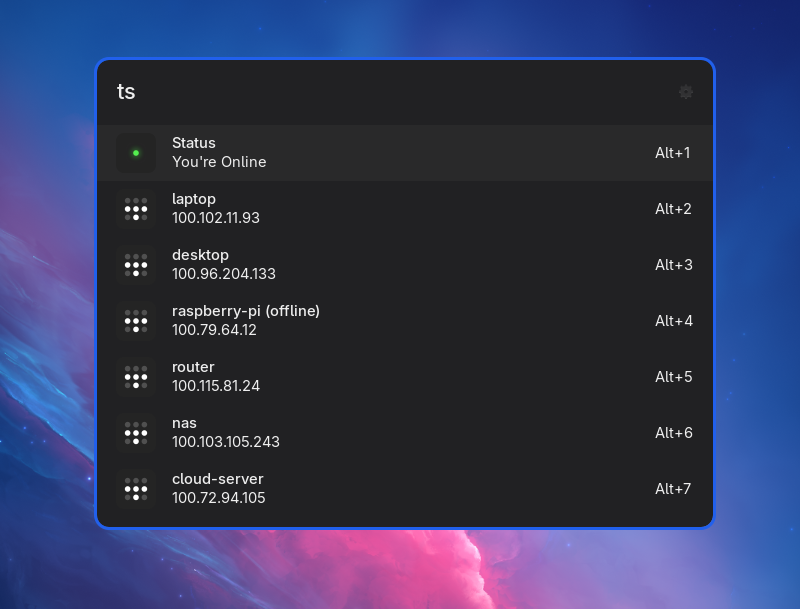

# ULauncher Tailscale

A ULauncher extension that lightly wraps Tailscale to expose node IPs and turning Tailscale on/off.

## Notes

This extension is not affiliated with, endorsed by, or sponsored by Tailscale Inc. All trademarks and brand names belong to their respective owners.
